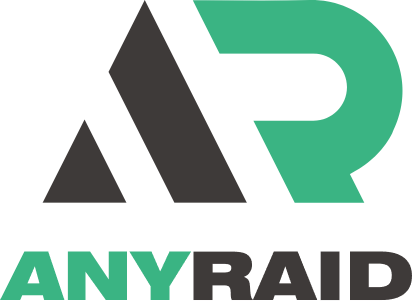

<div align="center">

<picture>
  
</picture>

[](https://github.com/ANYRAID/ANYRAID-ORCA)

</div>

# ANYRAID-ORCA

ANYRAID-ORCA 是面向 ANYRAID 研发工作流的开源 3D 打印切片器，也是 ANYRAID-WEBSLICER 使用的原生切片内核来源。

ANYRAID-ORCA is an open-source 3D-printing slicer for ANYRAID development workflows and the native slicing-engine source used by ANYRAID-WEBSLICER.

## 上游来源与许可证

本项目衍生自 [OrcaSlicer](https://github.com/OrcaSlicer/OrcaSlicer)，并继续包含来自 PrusaSlicer、BambuStudio、SuperSlicer、CuraSlicer 及其他开源组件的成果。所有上游版权、许可证和第三方归属声明均予以保留。

This project is derived from [OrcaSlicer](https://github.com/OrcaSlicer/OrcaSlicer) and retains the upstream copyright, license, and third-party attribution notices. See [LICENSE.txt](LICENSE.txt) and the in-application license information.

## 项目链接

- ANYRAID-ORCA：https://github.com/ANYRAID/ANYRAID-ORCA
- 上游 OrcaSlicer：https://github.com/OrcaSlicer/OrcaSlicer

# Main features

- **Advanced Calibration Tools**
  Comprehensive suite: temperature towers, flow rate, retraction, and more for optimal performance.
- **Precise Wall and Seam Control**
  Adjust outer wall spacing and apply scarf seams to enhance print accuracy.
- **Sandwich Mode and Polyholes Support**
  Use varied infill patterns and accurate hole shapes for improved clarity.
- **Overhang and Support Optimization**
  Modify geometry for printable overhangs with precise support placement.
- **Granular Controls and Customization**
  Fine-tune print speed, layer height, pressure, and temperature with precision.
- **Network Printer Support**
  Seamless integration with Klipper, PrusaLink, and OctoPrint for remote control.
- **Mouse Ear Brims and Adaptive Bed Mesh**
  Automatic brims and adaptive mesh calibration ensure consistent adhesion.
- **User-Friendly Interface**
  Intuitive drag-and-drop design with pre-made profiles for popular printers.
- **Open-Source and Community Driven**
  Regular updates fueled by continuous community contributions.
- **Wide Printer Compatibility**
  Supports a broad range of printers, including Bambu Lab, Prusa, Creality, and Voron.

Additional features can be found in the [ANYRAID-ORCA change notes](https://github.com/ANYRAID/ANYRAID-ORCA/releases/).

# Documentation

ANYRAID-ORCA does not link to or depend on the OrcaSlicer Wiki. Fork-specific documentation is maintained in this repository.

## 网络服务边界

- 默认禁用 OrcaSlicer 运营的版本检查、配置更新、账号、云同步和插件服务。
- 本地切片及用户显式配置的第三方打印机连接不受影响。
- 只有在 ANYRAID 服务地址、认证和兼容性验证完成后，才能重新启用对应在线能力。

By default, ANYRAID-ORCA does not connect to OrcaSlicer-operated version, profile, account, cloud-sync, or plugin services. Local slicing and explicitly configured third-party printer connections remain available.

# Download

## Stable Release

📥 **[Download the Latest Stable Release](https://github.com/ANYRAID/ANYRAID-ORCA/releases/latest)**
Visit the GitHub Releases page for the latest stable version of ANYRAID-ORCA.

## Nightly Builds

🌙 **[Download the Latest Nightly Build](https://github.com/ANYRAID/ANYRAID-ORCA/releases/tag/nightly-builds)**
Explore the latest developments in ANYRAID-ORCA with nightly builds.

### Belt Printer Builds

The nightly release may ship standard and belt-printer builds. Tell them apart by the filename suffix:

- **Standard** — no suffix, for example `ANYRAID-ORCA_Windows_Installer_x64_nightly.exe`
- **Belt** — `_belt` suffix, for example `ANYRAID-ORCA_Windows_Installer_x64_nightly_belt.exe`

The `_belt` builds add experimental support for belt or conveyor (infinite-Z) printers, including the slicing pipeline, mesh and G-code transforms, support generation, and tilted-bed preview.

> ⚠️ Belt printer support remains experimental.

# How to install

## Windows

Download the Windows installer for your CPU architecture from the [ANYRAID-ORCA releases page](https://github.com/ANYRAID/ANYRAID-ORCA/releases). A portable build may also be available.

If the application does not start, install the following runtimes when needed:

- [Microsoft Edge WebView2 Runtime](https://aka.ms/webview2)
- [Microsoft Visual C++ Redistributable](https://aka.ms/vs/17/release/vc_redist.x64.exe)

ANYRAID-ORCA currently has no official Microsoft Store or WinGet package.

## macOS

1. Download the universal DMG, which runs on Apple Silicon and Intel Macs.
2. Drag `ANYRAID-ORCA.app` to the Applications folder.
3. If macOS quarantines a PR build, open it once through the Finder context menu or remove the quarantine attribute:

   ```shell
   xattr -dr com.apple.quarantine /Applications/ANYRAID-ORCA.app
   ```

ANYRAID-ORCA does not use the upstream OrcaSlicer Homebrew package.

## Linux

### Flatpak

Build or install the ANYRAID-ORCA Flatpak bundle, then run it with the lowercase application ID:

```shell
flatpak run com.anyraid.anyraidorca
```

### AppImage

AppImages may be published for x86_64 and aarch64. Download the file matching your CPU, make it executable if required, and run it:

```shell
chmod +x /path/to/ANYRAID-ORCA_Linux.AppImage
```

# How to compile

Build entry points are maintained in this repository:

- Windows: `build_win.bat`
- macOS: `build_release_macos.sh`
- Linux: `build_linux.sh`
- Flatpak: `build_flatpak.sh`

# Klipper note

For Klipper printers, the following configuration is recommended in `printer.cfg`:

```gcode
# Enable object exclusion
[exclude_object]

# Enable arcs support
[gcode_arcs]
resolution: 0.1
```

# Upstream project support and attribution

Upstream OrcaSlicer is an open-source project. ANYRAID-ORCA retains its copyright, license, and third-party attribution notices and is grateful to its contributors, sponsors, and backers.

## Sponsors

<table>
<tr>
<td>
<a href="https://qidi3d.com/" style="display:inline-block; border-radius:8px; background:#fff;">
  
</a>
</td>
<td>
<a href="https://bigtree-tech.com/" style="display:inline-block; border-radius:8px; background:#222;">
  
</a>
</td>
</tr>
</table>

## Backers

**Ko-fi supporters** ☕: [Backers list](https://github.com/user-attachments/files/16147016/Supporters_638561417699952499.csv)

## Support the upstream project

<a href="https://github.com/sponsors/SoftFever"></a>
<a href="https://ko-fi.com/G2G5IP3CP"></a>
<a href="https://paypal.me/softfever3d"></a>

## Background

Open-source slicing has always been built on a tradition of collaboration and attribution. [Slic3r](https://github.com/Slic3r/Slic3r), created by Alessandro Ranellucci and the RepRap community, laid the foundation. [PrusaSlicer](https://github.com/prusa3d/PrusaSlicer) by Prusa Research built on Slic3r and acknowledged that heritage. [Bambu Studio](https://github.com/bambulab/BambuStudio) in turn forked from PrusaSlicer, and [SuperSlicer](https://github.com/supermerill/SuperSlicer) extended PrusaSlicer with community-driven enhancements.

OrcaSlicer began in that same spirit, drawing from BambuStudio, PrusaSlicer, and ideas inspired by CuraSlicer and SuperSlicer. It has since introduced advanced calibration tools, precise wall and seam control, tree supports, adaptive slicing, and many other features used throughout the 3D-printing community.

The OrcaSlicer logo was designed by community member [Justin Levine](https://github.com/jal-co).

# License

- OrcaSlicer and ANYRAID-ORCA are licensed under the GNU Affero General Public License, version 3.
- The AGPLv3 requires corresponding source availability when covered software is provided as a network service.
- OrcaSlicer includes a pressure advance calibration pattern derived from Andrew Ellis' GPLv3 generator, itself adapted from a Marlin generator by Sineos.
- The optional Bambu networking plugin is based on non-free libraries from Bambu Lab and provides extended functionality for compatible printers.
